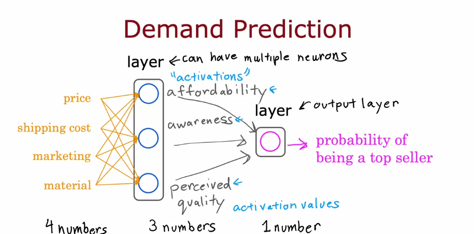
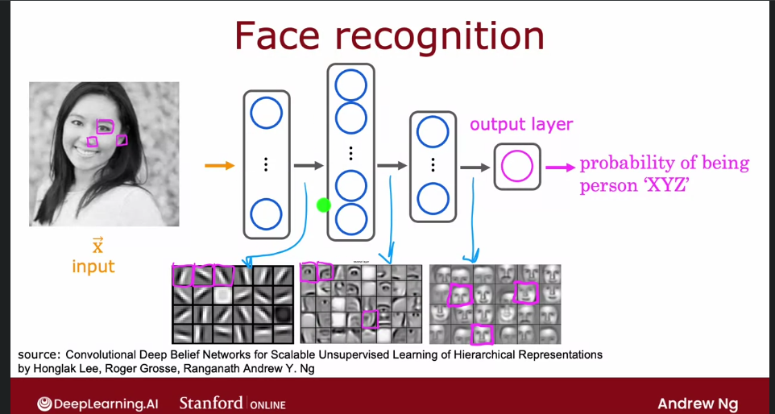
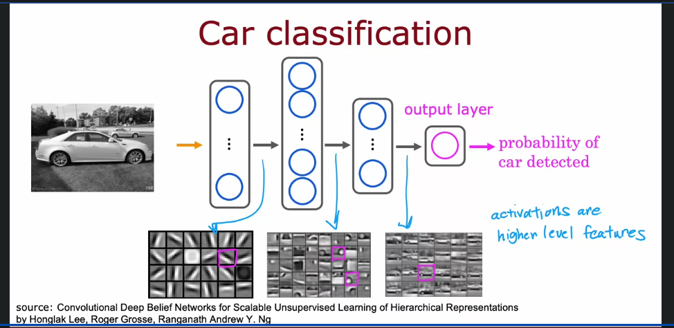
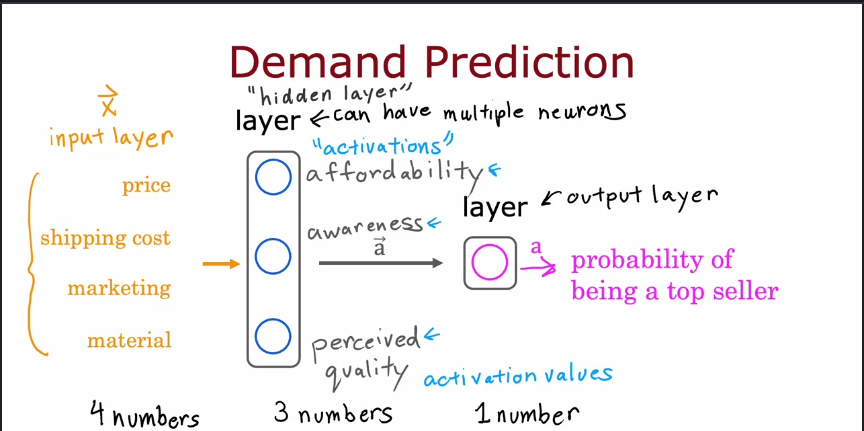

# Neural Networks: A Deep Dive into How Machines Learn

## What is a Neural Network?
Neural networks are a type of machine learning algorithm inspired by the structure and functioning of the human brain. They consist of layers of interconnected nodes (neurons) that process data, learn patterns, and make predictions. 

Neural networks have revolutionized fields like:
- **Speech Recognition** – Enabling voice assistants like Siri or Alexa.  
- **Image Processing** – Powering facial recognition and autonomous vehicles.  
- **Natural Language Processing (NLP)** – Understanding human language in applications like chatbots or translation services.  

---

## Origins: Mimicking the Brain  
The human brain is made up of billions of neurons, each responsible for processing and transmitting information. Neural networks attempt to replicate this through a simplified structure:  
1. **Inputs**: Information from the external environment (e.g., sensory input).  
2. **Outputs**: Decisions or actions based on the input.  
3. **Connections**: Output from one neuron can act as the input for another, creating a network of information flow.  

---

## How Neurons Work (Biological and Artificial)  
- In the brain, neurons receive signals through dendrites, process them, and generate output through axons.  
- In a neural network, **inputs (X)** are processed using **weights (W)** and **biases (b)** to generate outputs, which are passed to the next layer.  

---

### Mathematical Model of a Neuron
A single artificial neuron works by applying the following steps:  
1. **Summation**: Multiply inputs by weights and add a bias:  
   \[
   z = w_1x_1 + w_2x_2 + \dots + b
   \]
2. **Activation**: Apply an activation function \( f(z) \) to introduce non-linearity:  
   \[
   a = f(z) = \frac{1}{1 + e^{-z}}  \tag{Sigmoid Example}
   \]
3. **Output**: Pass the result to the next layer or provide the final prediction.  

---

## Why Are Neural Networks Popular Now?  
Neural networks have been around since the 1950s, but their rise to prominence is relatively recent. Why?  
- **Explosion of Data**: Digital transformation has generated vast amounts of data that traditional algorithms can't handle.  
- **Advances in Hardware**: GPUs and cloud computing have made it easier to train large networks quickly.  
- **Better Performance with Scale**: Unlike linear models, neural networks **improve with more data**, leading to state-of-the-art performance in many domains.  

---

## Neural Network Structure  
Neural networks consist of three primary types of layers:  

### 1. Input Layer  
- Takes raw data (e.g., pixel values, text embeddings).  
- Represents features like price, shipping cost, marketing spend, etc.  

### 2. Hidden Layers  
- Perform intermediate processing by transforming inputs into more complex representations.  
- Can have **one or many** hidden layers (deep networks).  

### 3. Output Layer  
- Produces the final result (e.g., probability of an item being a top seller).  

---

## Example 1: Demand Prediction (T-shirt Sales)  
Imagine you're selling T-shirts and want to predict whether a particular design will become a top seller.  

### Data Available:  
- **Inputs (X)**:  
  - Price  
  - Shipping Cost  
  - Marketing Effort  
  - Material Quality  
- **Output (y)**: Probability of the T-shirt being a top seller.  

---

### Network Design:  
- **Input Layer**: 4 features (price, shipping, etc.)  
- **Hidden Layer**: 3 neurons process input data into more abstract insights like **affordability, awareness, and quality**.  
- **Output Layer**: A single neuron outputs the probability that the T-shirt will be a top seller.  

---

### Visualization:  
  
*In this diagram, the hidden layer transforms raw inputs into meaningful intermediate values that lead to the final prediction.*  

---

### Why Not Use Logistic Regression?  
- Logistic regression can handle simple patterns but struggles with complex, non-linear relationships. Neural networks can model intricate dependencies across multiple variables.  

---

## Example 2: Image Recognition  
How does a computer recognize an image?  
- A computer sees an image as a matrix of **pixels (rows and columns)**, each with an intensity value.  
- Neural networks can identify features like edges, shapes, and objects through multiple processing layers.  

---

### Scenario: Face Recognition  
- **Goal**: Identify whether a person in a photo is "Person XYZ."  
- **Process**:  
  1. **Input** – A grayscale image of a face.  
  2. **Hidden Layers** – Extract features (e.g., eyes, nose, mouth).  
  3. **Output** – Probability that the face belongs to "Person XYZ."  

---

### Visualization:  
  
*Each layer progressively identifies more complex features, ultimately making a prediction.*  

---

## Example 3: Car Classification  
- **Task**: Detect whether a car is present in an image.  
- **Method**:  
  1. The first layers detect **edges and curves**.  
  2. The next layers recognize **wheels, windows, and car parts**.  
  3. The final layer classifies the image as "car detected" or "no car."  

---

### Visualization:  
  
*Lower layers identify simple features, while deeper layers recognize entire objects.*  

---

## Deep Neural Networks (DNNs) – Multiple Hidden Layers  
Why add more layers?  
- **Deeper networks** can learn hierarchical features, enabling them to model complex data distributions better.  

---

### Example:  
- **First Layer** – Detects basic shapes and edges.  
- **Second Layer** – Recognizes combinations of shapes.  
- **Third Layer** – Assembles shapes into objects (like cars or faces).  

---

### Visualization of Multiple Layers:  
  

---

## Summary: Why Neural Networks Matter  
Neural networks are transforming industries by automating complex tasks that were previously thought to require human intelligence. Their ability to:  
- Process vast datasets,  
- Learn intricate patterns, and  
- Continuously improve with more data  

…makes them a foundational technology in AI today.  

Whether it's **predicting T-shirt sales** or **identifying faces and cars**, neural networks provide the tools to build intelligent, adaptive systems that can revolutionize industries.  
